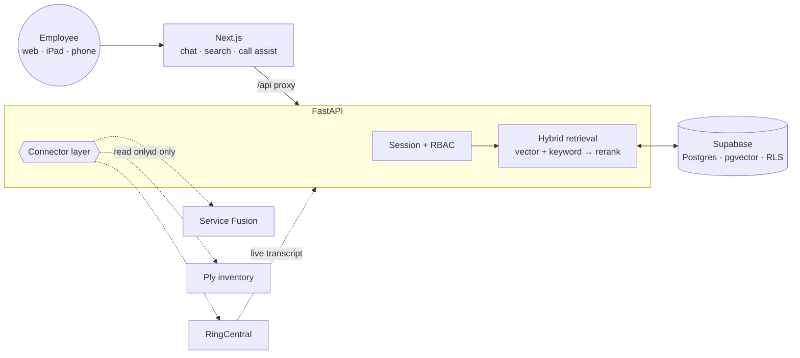

<h1 align="center">FieldOps Copilot</h1>

<p align="center">
  A private AI assistant for service businesses — the office staff, installers and
  technicians who need an answer from a 400-page manual while a customer is on the phone.
</p>

<p align="center">
  <a href="https://github.com/ilhanakbudak/fieldops-copilot/actions/workflows/ci.yml">
    </a>
  
  
  
  
</p>

> **🚧 Early scaffold.** The monorepo, toolchain and CI are in place. The
> retrieval pipeline and connectors land milestone by milestone — see
> [Status](#status).

---

## What this repository is

A **reference implementation**, not a product you can point at your own business.

That distinction is deliberate and it is worth stating plainly:

- The value in a system like this is in *your* manuals and *your* CRM. Neither
  can live in a public repository, so the corpus and every connector dataset here
  are synthetic.
- Service Fusion, Ply and RingCentral cannot function without your credentials.
  What is demonstrable is the **connector boundary** — the interface, the
  read-only guarantees, the error handling — with realistic mock backends behind it.
- Depth goes where it differentiates: retrieval quality, citation resolution, the
  security model, and cost control.

You should be able to read this and judge whether the author could build your
system. You should not be able to deploy it and have one.

---

## The problem it solves

A technician on a roof, an office manager mid-call, a salesperson quoting a job —
all needing a specific fact from a document nobody can find:

- *What does error code E-04 mean on this unit?*
- *What's our warranty on a radon water system?*
- *Pull up John Smith in Portland — what did we install and what was the last call about?*
- *Where's the 1-inch PEX ball valve and how many do we have?*

## Planned architecture



### Why Supabase and pgvector

Because the retrieval here is **not pure vector search.** Every real query is
similarity *filtered by* role and document type, and half of them need an exact
keyword match on a part number or error code — `E-04` and `E-14` are nearly
identical vectors.

In Postgres that is one query with a `WHERE` clause and a `tsvector` join. In a
dedicated vector database it is a metadata filter, a separate keyword system, and
a second store to secure, back up and pay for. At this document volume —
thousands, not billions — that buys nothing.

Supabase specifically because it is Postgres *plus* managed auth, storage for the
source PDFs, and row-level security enforced by the database rather than by
application code that can forget.

`VectorStore` is a protocol. A Weaviate or Qdrant adapter drops in the same way —
which is the honest answer to "which vector database", and why the local
`sqlite-vec` fallback exists: it makes the repository runnable with no accounts,
and proves the abstraction is real rather than asserted.

## Stack

| Layer | Choice |
|---|---|
| Web | Next.js 16, React 19, TypeScript |
| API | Python 3.13, FastAPI, Pydantic v2 |
| Data | Supabase — Postgres, pgvector, auth, storage, RLS |
| Embeddings | Local ONNX by default; OpenAI `text-embedding-3-small` in production |
| Generation | OpenAI, behind a provider abstraction |
| Realtime | WebSocket — transcript in, suggestions out |

Types shared between the two halves live in `packages/shared`, generated from the
FastAPI OpenAPI schema once the surface settles, so they cannot drift.

## Getting started

```bash
git clone https://github.com/ilhanakbudak/fieldops-copilot
cd fieldops-copilot

npm install                 # web + shared
npm run api:install         # python service, via uv

cp .env.example .env        # DEMO_MODE=true is the default
npm run dev                 # web on :3000, api on :8000
```

```bash
npm run verify              # exactly what CI runs, fail-fast
```

No accounts are needed in demo mode: a local vector store, local embeddings, and
synthetic data.

## Layout

```
fieldops-copilot/
├── apps/web/           Next.js — chat, customer search, inventory, call assist
├── services/api/       FastAPI — ingestion, retrieval, connectors, realtime
├── packages/shared/    types shared across the boundary
└── infra/              Supabase migrations, indexes, RLS policies
```

## Status

| Milestone | |
|---|---|
| 0 · Monorepo, toolchain, CI | ✅ |
| 1 · Document ingestion + hybrid retrieval with citations | ⬜ |
| 2 · Service Fusion connector (read-only) | ⬜ |
| 3 · Ply inventory connector | ⬜ |
| 4 · RingCentral caller lookup | ⬜ |
| 5 · Real-time call assistance | ⬜ |
| 6 · Security, deployment, documentation | ⬜ |

## Related

[**whatsapp-guest-concierge**](https://github.com/ilhanakbudak/whatsapp-guest-concierge) —
a finished WhatsApp AI concierge: Twilio, multi-provider LLM tool use, Google
Calendar, and a durable broadcast system. 412 tests.

## License

MIT
