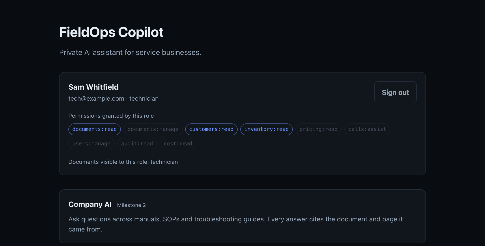
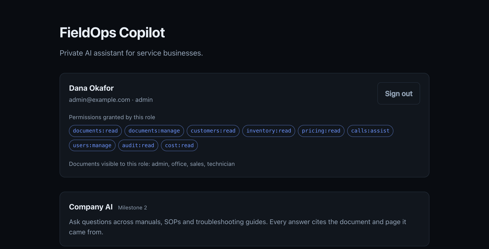
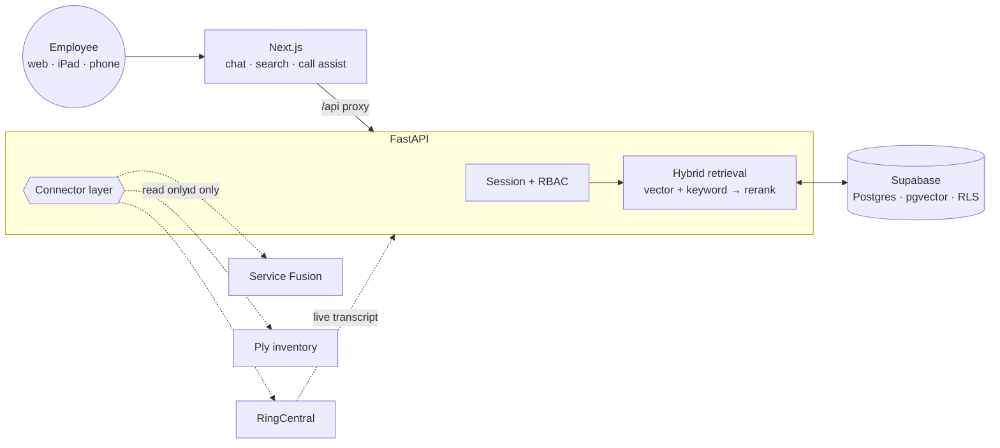

<h1 align="center">FieldOps Copilot</h1>

<p align="center">
  A private AI assistant for service businesses — the office staff, installers and
  technicians who need an answer from a 400-page manual while a customer is on the phone.
</p>

<p align="center">
  <a href="https://github.com/ilhanakbudak/fieldops-copilot/actions/workflows/ci.yml">
    </a>
  
  
  
  
</p>

> **🚧 In progress.** Authentication, roles and the audit trail are done and
> demonstrable — clone it and sign in. The retrieval pipeline and the connectors
> land milestone by milestone; see [Status](#status).

---

## What this repository is

A **reference implementation**, not a product you can point at your own business.

That distinction is deliberate and it is worth stating plainly:

- The value in a system like this is in *your* manuals and *your* CRM. Neither
  can live in a public repository, so the corpus and every connector dataset here
  are synthetic.
- Service Fusion, Ply and RingCentral cannot function without your credentials.
  What is demonstrable is the **connector boundary** — the interface, the
  read-only guarantees, the error handling — with realistic mock backends behind it.
- Depth goes where it differentiates: retrieval quality, citation resolution, the
  security model, and cost control.

You should be able to read this and judge whether I could build your
system.

---

## The problem it solves

A technician on a roof, an office manager mid-call, a salesperson quoting a job —
all needing a specific fact from a document nobody can find:

- *What does error code E-04 mean on this unit?*
- *What's our warranty on a radon water system?*
- *Pull up John Smith in Portland — what did we install and what was the last call about?*
- *Where's the 1-inch PEX ball valve and how many do we have?*

## Signing in

Four synthetic employees, one per role. Signing in as each shows what that role
is allowed to do — and the same table is what the API authorises against, not a
decoration on top of it.

<p align="center">
  
  <br><em>Technician — no pricing, no call assist, no administration.</em>
</p>

<p align="center">
  
  <br><em>The same screen as an administrator.</em>
</p>

## Planned architecture



### How access control is enforced

The interesting decision is not that there are roles. It is **where the role
filter runs.**

If a technician may not read pricing rules, those chunks must never enter the
candidate set. Filtering after retrieval — fetch the top 20, drop what the
caller cannot see — looks equivalent and is not: the moment anything assembles a
prompt from that list before the filter runs, restricted text goes into the
model's context and out through its answer. The UI never shows it; the answer
quotes it.

So the caller's role is a required argument to retrieval, `chunks` carries the
audience it belongs to on the row the vector index already scans, and on
Postgres **row-level security enforces the same rule underneath the
application** — policies keyed on a `SET LOCAL` setting the API applies per
transaction, with `FORCE ROW LEVEL SECURITY` so the connecting role does not
bypass its own policies.

That last layer is the strongest argument for Postgres here. A filter in
application code is one refactor away from being wrong; a policy in the database
is not.

Sessions are server-side rather than JWTs, for one concrete reason: "disable an
employee account" has to mean *now*. Disabling revokes live sessions in the same
transaction, and so does a role change — a demotion that waits for the next
login is not a demotion.

The reasoning in full — including the mistake I made and fixed on the way — is
in [**docs/SECURITY.md**](docs/SECURITY.md).

### Why Supabase and pgvector

Because the retrieval here is **not pure vector search.** Every real query is
similarity *filtered by* role and document type, and half of them need an exact
keyword match on a part number or error code — `E-04` and `E-14` are nearly
identical vectors.

In Postgres that is one query with a `WHERE` clause and a `tsvector` join. In a
dedicated vector database it is a metadata filter, a separate keyword system, and
a second store to secure, back up and pay for. At this document volume —
thousands, not billions — that buys nothing.

Supabase specifically because it is Postgres *plus* storage for the source PDFs
and row-level security enforced by the database rather than by application code
that can forget.

Its hosted auth is the one part I did not take. Employee accounts here are
ordinary rows this application owns, so a business can move the whole system
between providers without re-registering its staff — and because the
authorisation decision that actually matters, which documents a role may read,
is a property of the corpus rather than of the identity provider. Argon2id and a
`sessions` table is not the hard part of this system.

`VectorStore` is a protocol. A Weaviate or Qdrant adapter drops in the same way —
which is the honest answer to "which vector database", and why the local
`sqlite-vec` fallback exists: it makes the repository runnable with no accounts,
and proves the abstraction is real rather than asserted.

## Stack

| Layer | Choice |
|---|---|
| Web | Next.js 16, React 19, TypeScript |
| API | Python 3.13, FastAPI, Pydantic v2 |
| Data | Supabase — Postgres, pgvector, storage, RLS; SQLAlchemy 2 + Alembic |
| Auth | Server-side sessions, Argon2id, RBAC enforced in the retrieval query |
| Embeddings | Local ONNX by default; OpenAI `text-embedding-3-small` in production |
| Generation | OpenAI, behind a provider abstraction |
| Realtime | WebSocket — transcript in, suggestions out |

Types shared between the two halves live in `packages/shared`, generated from the
FastAPI OpenAPI schema once the surface settles, so they cannot drift.

## Getting started

```bash
git clone https://github.com/ilhanakbudak/fieldops-copilot
cd fieldops-copilot

npm install                 # web + shared
npm run api:install         # python service, via uv

cp .env.example .env        # DEMO_MODE=true is the default
npm run dev                 # web on :3000, api on :8000
```

Open <http://localhost:3000> and sign in. In demo mode the API migrates its
database and seeds four employees on boot, so there is nothing else to run:

| Account | Role |
|---|---|
| `admin@example.com` | admin |
| `office@example.com` | office |
| `sales@example.com` | sales |
| `tech@example.com` | technician |

The password for all four is `demo-password-1234`. They are synthetic, and
`example.com` is the reserved documentation domain, so none of this can be
mistaken for a real address.

```bash
npm run verify              # exactly what CI runs, fail-fast
npm run api:migrate         # apply migrations against a real Postgres
npm run api:seed            # re-seed the demo accounts
```

No accounts are needed in demo mode: a local SQLite database, a local vector
store, local embeddings, and synthetic data. Point `DATABASE_URL` at a Supabase
project and the same migrations bring up pgvector, the full-text index and the
row-level security policies — see [`infra/README.md`](infra/README.md).

## Layout

```
fieldops-copilot/
├── apps/web/           Next.js — sign-in, chat, customer search, call assist
├── services/api/
│   ├── app/auth/       sessions, password hashing, the permission table
│   ├── app/audit/      the append-only trail, and cost accounting
│   ├── app/db/         models, dialect-portable column types, seed data
│   ├── app/api/        routes, dependencies, request context
│   └── alembic/        migrations — the single source of truth for the schema
├── packages/shared/    types shared across the boundary
└── infra/              deployment notes, Supabase preparation
```

## Status

| Milestone | |
|---|---|
| 0 · Monorepo, toolchain, CI | ✅ |
| 1 · Authentication, roles, audit trail, data layer | ✅ |
| 2 · Document ingestion + hybrid retrieval with citations | ⬜ |
| 3 · Service Fusion connector (read-only) | ⬜ |
| 4 · Ply inventory connector | ⬜ |
| 5 · RingCentral caller lookup and real-time call assistance | ⬜ |
| 6 · Cost dashboard, deployment, documentation | ⬜ |

Milestone 1 in detail: Argon2id passwords, revocable server-side sessions with a
sliding idle window and a hard ceiling, four roles behind one permission table,
an append-only audit trail correlated by request id, account disable that takes
effect on the live session, and Postgres row-level security — exercised against
a real `pgvector` container in CI, because policies nobody runs are not a
security model. 74 tests.

## Related

[**whatsapp-guest-concierge**](https://github.com/ilhanakbudak/whatsapp-guest-concierge) —
a finished WhatsApp AI concierge: Twilio, multi-provider LLM tool use, Google
Calendar, and a durable broadcast system. 412 tests.

## License

MIT
