<h1 align="center">FieldOps Copilot</h1>

<p align="center">
  A private AI assistant for service businesses — the office staff, installers and
  technicians who need an answer from a 400-page manual while a customer is on the phone.
</p>

<p align="center">
  <a href="https://github.com/ilhanakbudak/fieldops-copilot/actions/workflows/ci.yml">
    </a>
  
  
  
  
</p>

> **🚧 In progress.** Sign in, upload a manual, ask questions of it, pull a
> customer up, find a part, and have a caller's record on screen before the
> phone is answered — that works today, with an agent that decides which of
> those a question actually needs. Live call assist and deployment land next;
> see [Status](#status).

---

## What this repository is

A **reference implementation**, not a product you can point at your own business.

That distinction is deliberate and it is worth stating plainly:

- The value in a system like this is in *your* manuals and *your* CRM. Neither
  can live in a public repository, so the corpus and every connector dataset here
  are synthetic.
- Service Fusion, Ply and RingCentral cannot function without your credentials.
  What is demonstrable is the **connector boundary** — the interface, the
  read-only guarantees, the error handling — with realistic mock backends behind it.
- Depth goes where it differentiates: retrieval quality, citation resolution, the
  security model, and cost control.

You should be able to read this and judge whether I could build your
system.

---

## The problem it solves

A technician on a roof, an office manager mid-call, a salesperson quoting a job —
all needing a specific fact from a document nobody can find:

- *What does error code E-04 mean on this unit?*
- *What's our warranty on a radon water system?*
- *Pull up John Smith in Portland — what did we install and what was the last call about?*
- *Where's the 1-inch PEX ball valve and how many do we have?*

## What it does today

<p align="center">
  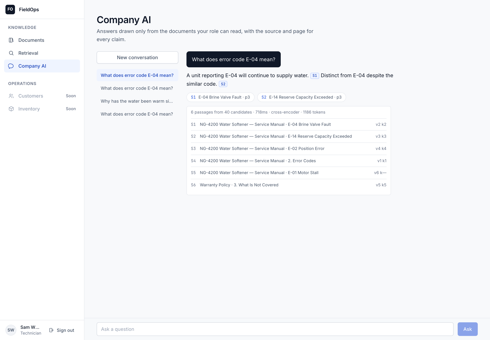
</p>

Ask a question, get an answer with a citation on every claim. Each `[S1]` is a
chip: click it and the passage it came from opens underneath, with the document,
section and page.

**It decides what to do.** This is not a chat window bolted to a search index:

<p align="center">
  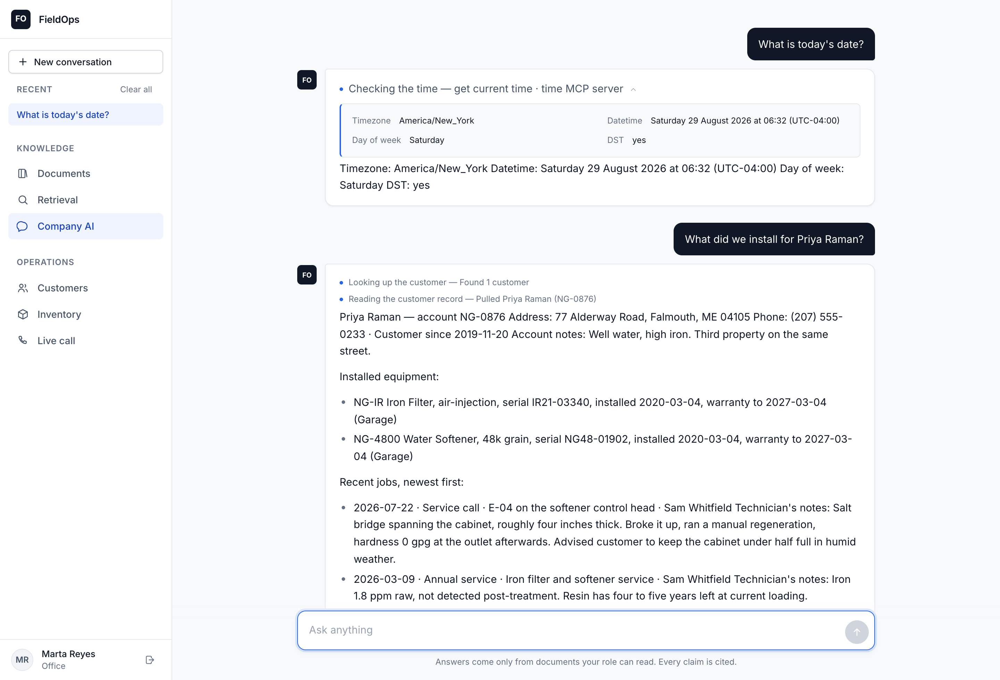
</p>

Asked the date, it calls a clock and the retrieval pipeline never runs — and the
clock is **not a tool I wrote**. It is
[`mcp-server-time`](https://github.com/modelcontextprotocol/servers), one of the
official Model Context Protocol reference servers, running as a subprocess and
discovered over MCP. Adding another integration is a line of configuration
rather than a module.

Asked what was installed for a customer, it searches the CRM, gets one match,
and *chains* into reading that record. The trail above the answer is that
decision made visible: when an answer is wrong, it separates a bad decision from
a bad execution.

**The same question, asked by someone who may not read the answer:**

<p align="center">
  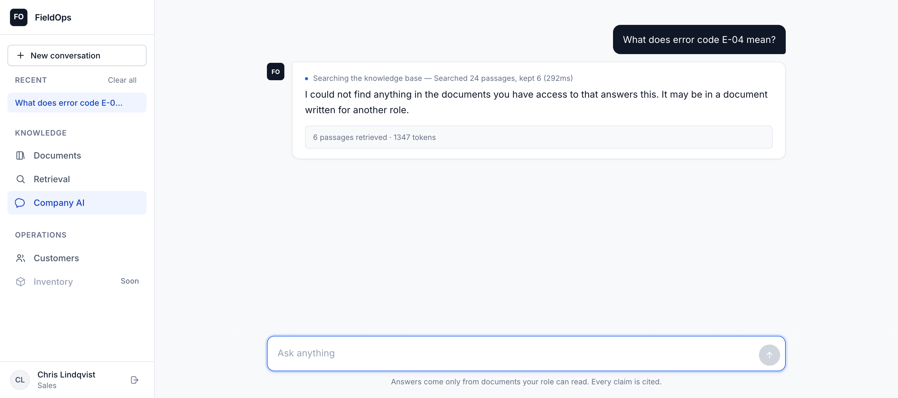
  <br><em>Sales cannot read service manuals. Not filtered out of the answer —
  those passages never entered the candidate set. The tools are gated the same
  way: a technician's model is never told a pricing lookup exists.</em>
</p>

**Parts, and the role boundary inside a single answer:**

<p align="center">
  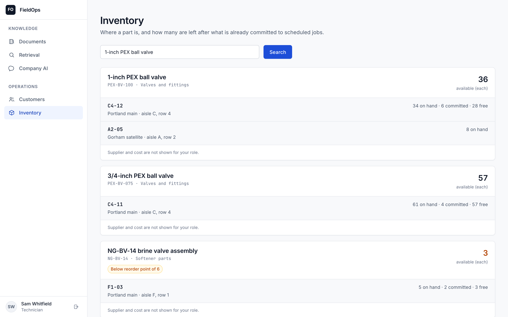
  <br><em>A technician gets the bin and the count. A salesperson asking the same
  question also gets supplier and cost — the gate is on the fields, not the
  tool, because the tool is useful to everyone and half of it is not.</em>
</p>

The count is net of what is already committed to scheduled jobs. Somebody told
there are five of something who arrives to find two spoken for has been given a
true number and a useless one.

**Customer records, read-only by construction:**

<p align="center">
  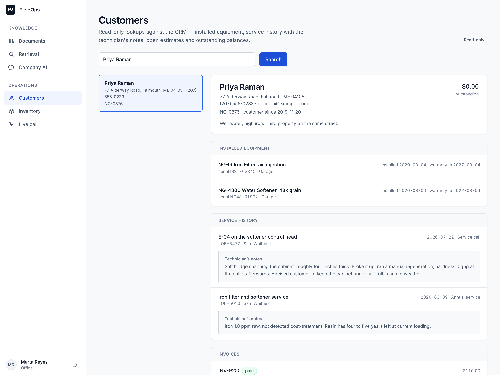
  <br><em>The technician's notes get the emphasis. They are the most useful
  thing in a service record and the hardest thing to find in most CRMs.</em>
</p>

Documents are tagged with the roles they are written for. That tag is not a label
on a screen: it is copied onto every chunk, and it is what the retrieval query
filters on.

<p align="center">
  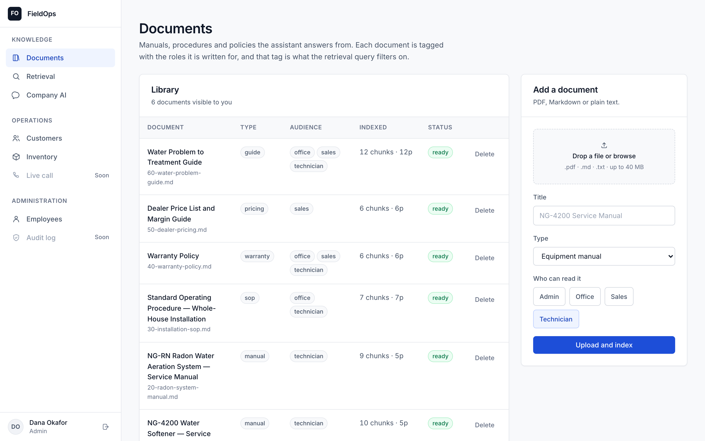
</p>

There is also a **Retrieval** page that runs the search with no model in the
loop, showing raw passages and similarity scores — the tool for asking whether
retrieval is the problem before changing anything about the prompt.

### The phone rings and the record is already up

<p align="center">
  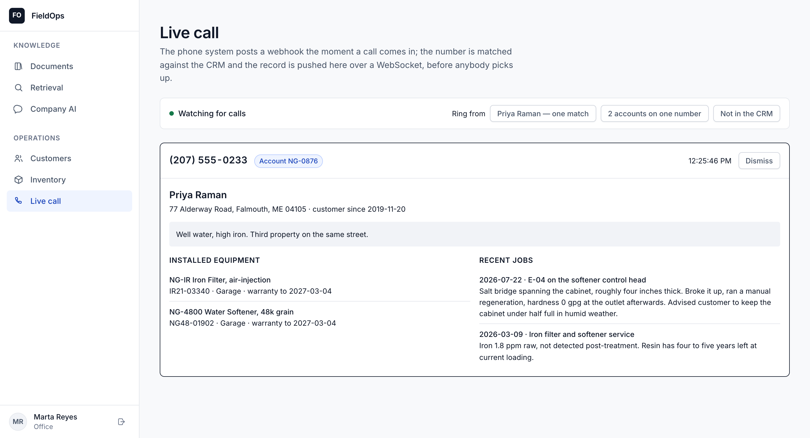
</p>

The phone system posts a webhook, the number is normalised and matched against
the CRM, and the record is pushed to the office over a WebSocket — equipment,
warranty dates and the last technician's notes, on screen before anybody says
hello.

The interesting case is the one below it.

<p align="center">
  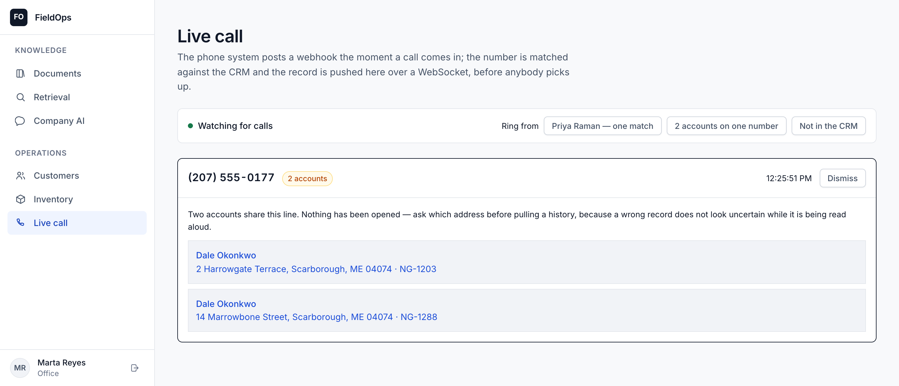
</p>

Two accounts share that line — one owner, two properties, the same number on
both — and the page opens **neither**. A phone number is not a key in any CRM
that has been in use for a while, and picking the first match would put the
wrong address on screen at the exact moment somebody is reading it aloud. A
wrong record never looks uncertain. So `find_by_phone` returns a list, and an
ambiguous list is a question rather than an answer.

The webhook itself answers `204` to everything — a verified call, a bad token,
a malformed body. A status that varied would let anyone on the internet ask this
business, at whatever rate they liked, which phone numbers belong to its
customers. See [docs/CALLS.md](docs/CALLS.md).

<p align="center">
  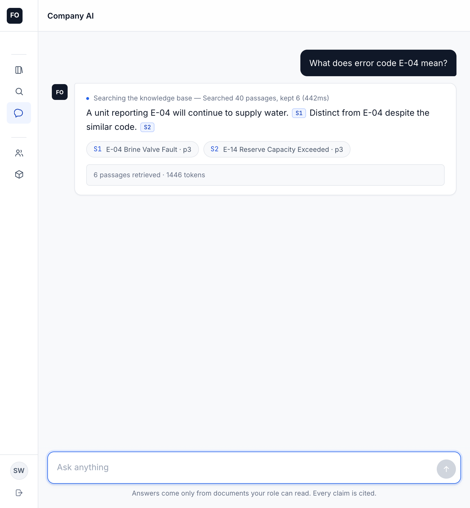
  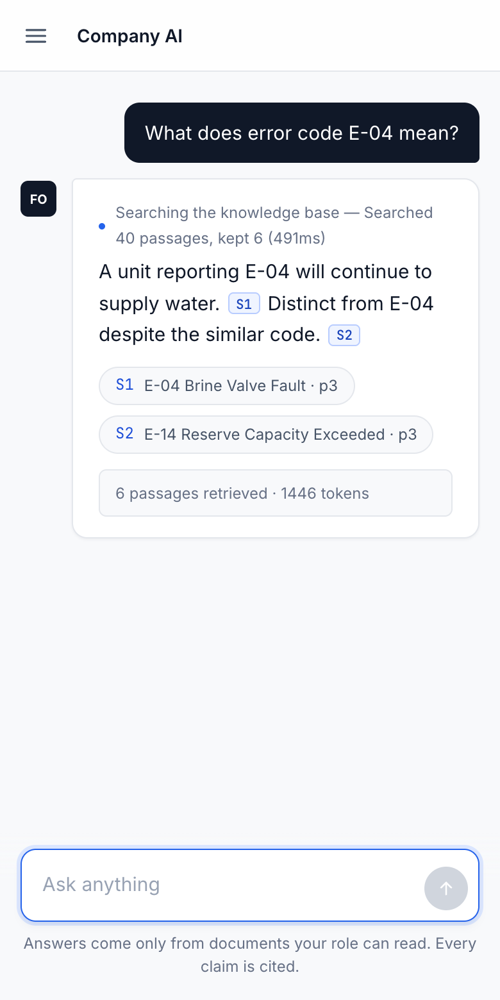
  <br><em>iPad and phone. Three layouts, chosen by what the screen can do rather
  than by device name.</em>
</p>

## Planned architecture

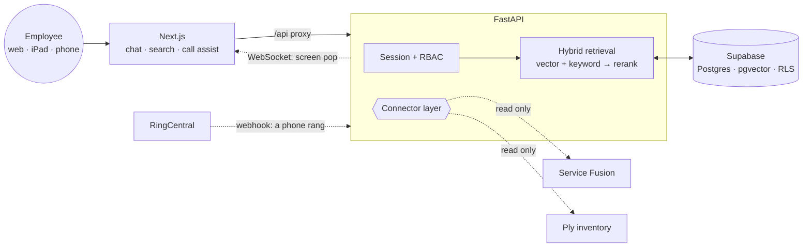

### The agent

Retrieval is a tool the model may call, not what the endpoint does. Four
constraints on the loop, each because the obvious version fails:

- **Tools are role-gated, like documents.** Built per request from the caller's
  principal. Stronger than refusing a call — a tool the model cannot see is one
  it cannot be talked into using.
- **A step ceiling**, and on the final step the tools are *withdrawn* rather
  than the loop stopping, so the model has to answer with what it has.
- **Tools in one step run concurrently.** Two lookups cost the slower, not the
  sum.
- **A failing tool is a result, not an exception.** "The CRM did not answer"
  reaches the model, which can say so. And it must never look like an empty
  answer: *no customer found* and *the lookup failed* lead to completely
  different next actions.

Full reasoning, including why an MCP server is worth it for a clock, in
[**docs/AGENT.md**](docs/AGENT.md).

### How a document becomes an answer

```
INGEST   bytes → pages → blocks → units → chunks → vectors → rows
QUERY    question → analyse → vector ∥ keyword → fuse → rerank → expand → budget
                                                            ↓
                                    prompt → model → resolve citations
```

Four of those steps are where the quality actually comes from, and each exists
because the obvious implementation fails in a way that is hard to see:

**A page is the unit of extraction, not a document.** So a scanned insert inside
an otherwise digital manual falls through to OCR on its own, and "which pages
needed OCR" is answerable afterwards. Running OCR over a 400-page manual to
recover three scanned diagrams costs a hundred times what the diagrams are worth.

**Blocks are merged before they become chunks.** Split a manual on blank lines
and `### E-04 Brine Valve Fault` is a block of its own. Emit that as a chunk and
it embeds beautifully against a query about that heading and contains no answer.
Headings are merged forward into the text they introduce.

**Search runs twice and the ranks are fused.** Embeddings put `E-04` and `E-14`
almost on top of each other — two characters apart in a space built to collapse
surface differences. Lexical search tells them apart perfectly and cannot tell
"warm water" from "elevated temperature". Reciprocal rank fusion keeps only the
ranks, because a cosine similarity and a BM25 score share no scale.

**Citations are resolved, never requested.** Asking a model to name its sources
produces plausible, invented ones with no way for a reader to tell. Instead each
passage is rendered under an opaque marker, the model may only emit those
markers, and the API resolves them against what was actually retrieved before
the response leaves the server. A marker the model invented is stripped from the
text — the sentence survives, the false attribution does not.

PDF extraction defaults to **pdfplumber** rather than PyMuPDF, and that is a
licence decision as much as a technical one: PyMuPDF is faster and is AGPL-3.0,
which an MIT repository should not take as a hard dependency on its users'
behalf. It is an opt-in extra behind the same protocol.

The whole pipeline — including the measured ablation, which OCR engine, and why
the benchmark leader is the wrong default — is in [**docs/RAG.md**](docs/RAG.md).

### How access control is enforced

The interesting decision is not that there are roles. It is **where the role
filter runs.**

If a technician may not read pricing rules, those chunks must never enter the
candidate set. Filtering after retrieval — fetch the top 20, drop what the
caller cannot see — looks equivalent and is not: the moment anything assembles a
prompt from that list before the filter runs, restricted text goes into the
model's context and out through its answer. The UI never shows it; the answer
quotes it.

So `roles` is a required argument on the vector store's protocol — no default,
no overload without it — `chunks` carries the audience it belongs to on the row
the vector index already scans, and on Postgres **row-level security enforces
the same rule underneath the application**: policies keyed on a `SET LOCAL`
setting the API applies per transaction, with `FORCE ROW LEVEL SECURITY` so the
connecting role does not bypass its own policies.

That last layer is the strongest argument for Postgres here. A filter in
application code is one refactor away from being wrong; a policy in the database
is not.

Sessions are server-side rather than JWTs, for one concrete reason: "disable an
employee account" has to mean *now*. Disabling revokes live sessions in the same
transaction, and so does a role change — a demotion that waits for the next
login is not a demotion.

The reasoning in full — including the mistake I made and fixed on the way — is
in [**docs/SECURITY.md**](docs/SECURITY.md).

### Why Supabase and pgvector

Because the retrieval here is **not pure vector search.** Every real query is
similarity *filtered by* role and document type, and half of them need an exact
keyword match on a part number or error code — `E-04` and `E-14` are nearly
identical vectors.

In Postgres that is one query with a `WHERE` clause and a `tsvector` join. In a
dedicated vector database it is a metadata filter, a separate keyword system, and
a second store to secure, back up and pay for. At this document volume —
thousands, not billions — that buys nothing.

Supabase specifically because it is Postgres *plus* storage for the source PDFs
and row-level security enforced by the database rather than by application code
that can forget.

Its hosted auth is the one part I did not take. Employee accounts here are
ordinary rows this application owns, so a business can move the whole system
between providers without re-registering its staff — and because the
authorisation decision that actually matters, which documents a role may read,
is a property of the corpus rather than of the identity provider. Argon2id and a
`sessions` table is not the hard part of this system.

`VectorStore` is a protocol. A Weaviate or Qdrant adapter drops in the same way —
which is the honest answer to "which vector database", and why the local SQLite
fallback exists: it makes the repository runnable with no accounts, and proves
the abstraction is real rather than asserted. That fallback does exact
brute-force cosine with no index, which is correct at demo scale and is
precisely the thing pgvector's HNSW replaces once the corpus is real.

## Stack

| Layer | Choice |
|---|---|
| Web | Next.js 16, React 19, TypeScript |
| API | Python 3.13, FastAPI, Pydantic v2 |
| Data | Supabase — Postgres, pgvector, storage, RLS; SQLAlchemy 2 + Alembic |
| Auth | Server-side sessions, Argon2id, RBAC enforced in the retrieval query |
| Ingestion | pdfplumber (MIT) · PyMuPDF and PaddleOCR as optional extras |
| Embeddings | Local ONNX by default; OpenAI `text-embedding-3-small` in production — both at 384 dimensions, so the schema does not change when a deployment switches |
| Agent | Tool-calling loop, role-gated toolset, MCP client over stdio |
| Retrieval | Hybrid vector + FTS, reciprocal rank fusion, local cross-encoder rerank |
| Generation | OpenAI, behind a provider abstraction — with an extractive mock so the repository runs with no key |
| Realtime | WebSocket — transcript in, suggestions out |

Types shared between the two halves live in `packages/shared`, generated from the
FastAPI OpenAPI schema once the surface settles, so they cannot drift.

## Getting started

```bash
git clone https://github.com/ilhanakbudak/fieldops-copilot
cd fieldops-copilot

npm install                 # web + shared
npm run api:install         # python service, via uv

cp .env.example .env        # DEMO_MODE=true is the default
npm run dev                 # web on :3000, api on :8000
```

Open <http://localhost:3000> and sign in. In demo mode the API migrates its
database and seeds four employees on boot, so there is nothing else to run:

| Account | Role |
|---|---|
| `admin@example.com` | admin |
| `office@example.com` | office |
| `sales@example.com` | sales |
| `tech@example.com` | technician |

The password for all four is `demo-password-1234`. They are synthetic, and
`example.com` is the reserved documentation domain, so none of this can be
mistaken for a real address.

On first run the API downloads a ~130 MB ONNX embedding model, then caches it —
so the first boot takes about half a minute and every one after that is
instant. It also ingests the synthetic corpus, six documents of a fictional
water-treatment company, so there is something to search immediately.

```bash
npm run verify              # exactly what CI runs, fail-fast
npm run api:migrate         # apply migrations against a real Postgres
npm run api:seed            # re-seed the demo accounts and corpus
npm run screenshots         # regenerate the images above from a running instance
npm run eval                # score retrieval; --compare ablates each stage
```

Answers in demo mode come from an **extractive stand-in**, not a language model.
It routes tools by keyword and selects sentences from what they return, rather
than paraphrasing. That is stated plainly because the alternative is a reviewer
seeing fluent prose and believing otherwise. What it demonstrates is the
machinery — tool routing, retrieval, role filtering, citation resolution,
streaming, cost accounting. Set `LLM_PROVIDER=openai` with a key and the same
loop runs with a model deciding instead.

No accounts are needed in demo mode: a local SQLite database, a local vector
store, local embeddings, and synthetic data. Point `DATABASE_URL` at a Supabase
project and the same migrations bring up pgvector, the full-text index and the
row-level security policies — see [`infra/README.md`](infra/README.md).

## Layout

```
fieldops-copilot/
├── apps/web/           Next.js — sign-in, chat, customer search, call assist
├── services/api/
│   ├── app/auth/       sessions, password hashing, the permission table
│   ├── app/audit/      the append-only trail, and cost accounting
│   ├── app/db/         models, dialect-portable column types, seed data
│   ├── app/api/        routes, dependencies, request context
│   ├── app/agent/      the loop, the tools, the MCP client
│   ├── app/connectors/ CRM and inventory protocols · vendor adapters · mocks
│   ├── app/llm/        provider abstraction, cost accounting
│   ├── app/rag/        extract · chunk · embed · store · search · cite · answer
│   └── alembic/        migrations — the single source of truth for the schema
├── packages/shared/    types shared across the boundary
├── fixtures/corpus/    the synthetic corpus, as reviewable Markdown
├── fixtures/eval/      the retrieval evaluation set
├── fixtures/crm/       the synthetic customer book
├── fixtures/inventory/ the synthetic parts catalogue
└── infra/              deployment notes, Supabase preparation
```

## Status

| Milestone | |
|---|---|
| 0 · Monorepo, toolchain, CI | ✅ |
| 1 · Authentication, roles, audit trail, data layer | ✅ |
| 2 · Document ingestion + role-filtered vector retrieval | ✅ |
| 3 · Hybrid retrieval, reranking, chat with citations | ✅ |
| 4 · Agentic tool use, MCP integration, chat interface | ✅ |
| 5 · Service Fusion connector (read-only) | ✅ |
| 6 · Ply inventory connector, employee administration | ✅ |
| 7 · RingCentral caller lookup, screen pop over WebSocket | ✅ |
| 8 · Live call assistance, cost dashboard, deployment | ⬜ |

**Milestone 1** — Argon2id passwords, revocable server-side sessions with a
sliding idle window and a hard ceiling, four roles behind one permission table,
an append-only audit trail correlated by request id, account disable that takes
effect on the live session, and Postgres row-level security, exercised against a
real `pgvector` container in CI because policies nobody runs are not a security
model.

**Milestone 2** — a page-level extraction pipeline with OCR fallback,
structure-aware chunking with parent sections, three embedding providers at one
vector width, two vector stores behind one protocol, and document management
with role tagging that rewrites its chunks.

**Milestone 3** — query analysis on a cheap model, hybrid vector + full-text
search fused on rank, cross-encoder reranking with exact-term ordering, parent
expansion under a context budget, structurally resolved citations, and a
streamed chat endpoint. Plus an evaluation set and a script that scores
recall@k and MRR, with an ablation for each stage.

**Milestone 4** — an agent loop with role-gated tools, a **Model Context
Protocol client** consuming the official `mcp-server-time`, tool-call streaming
on both providers, and a chat interface with Markdown, inline citation chips,
message editing and history.

**Milestone 5** — a read-only `CrmConnector` protocol, a Service Fusion adapter,
a mock backed by a synthetic customer book, both exposed as tools and as a
Customer Search page.

**Milestone 6** — an `InventoryConnector` on the same pattern with a Ply-shaped
adapter, field-level pricing gating, an Inventory page, and employee
administration with component tests.

**Milestone 7** — a `TelephonyConnector` with a RingCentral adapter and a mock
that verifies rather than waving everything through, an inbound-call webhook
that answers identically whatever it is given, phone normalisation into a CRM
lookup that returns a *list*, and a permission-gated WebSocket fan-out with a
bounded queue per subscriber. Plus the audit and retrieval work described under
[Documentation](#documentation): every agent tool call is now recorded where the
tools are invoked, and the evaluation set gained a confusable second manual.
279 tests.

## Documentation

| | |
|---|---|
| [docs/AGENT.md](docs/AGENT.md) | Tool routing, the MCP integration, and the loop's constraints |
| [docs/RAG.md](docs/RAG.md) | The whole pipeline, ingest and query, with the measured ablation |
| [docs/CALLS.md](docs/CALLS.md) | The caller-lookup webhook, why it always answers 204, and the fan-out |
| [docs/SECURITY.md](docs/SECURITY.md) | Sessions, the role filter, the audit trail |
| [infra/README.md](infra/README.md) | Migrations, and preparing a Supabase project |
| [fixtures/README.md](fixtures/README.md) | The synthetic corpus and what each document is for |

## Related

[**whatsapp-guest-concierge**](https://github.com/ilhanakbudak/whatsapp-guest-concierge) —
a finished WhatsApp AI concierge: Twilio, multi-provider LLM tool use, Google
Calendar, and a durable broadcast system. 412 tests.

## License

MIT
